# Edge

This is the app you actually hold. It connects to a WHOOP 4.0 band over Bluetooth, pulls
the data off it, sends it to a backend, and shows you what came back. Flutter, runs on
iOS and Android. The band measures, the backend thinks, this app is the hands and the
face.

> Not affiliated with WHOOP. This is for a band you own.

## First, the honest version

If your WHOOP subscription has lapsed and the band's just sitting there, this gives it
something to do again. You get your heart rate, your sleep, a strain number, a recovery
number, trends over time. It's real and it's useful.

Is it WHOOP? No. I'm not going to oversell this. WHOOP has years of research and a team;
this is one person, textbook equations, and a protocol I reverse-engineered. The numbers
here are honest approximations of what your band can actually support, not a clone of
their scores. Think of it as rescuing the hardware, not replacing the service. If you're
happily paying WHOOP, stay there. If your band would otherwise be e-waste, this is better
than a drawer.

And there are bugs. I know about some, probably not all. If something looks wrong, it
might be wrong, open an issue and I'll chase it down. This gets better the more people use
it and report what breaks.

**One important thing:** once you start using this, don't reconnect the band to the
official WHOOP app. It might push a firmware update, and that could change or break the
events and records this depends on. I've only tested on WHOOP 4.0 as it ships today. Pick
one app and stick with it.

## Screens

| | | |
|:--:|:--:|:--:|
| 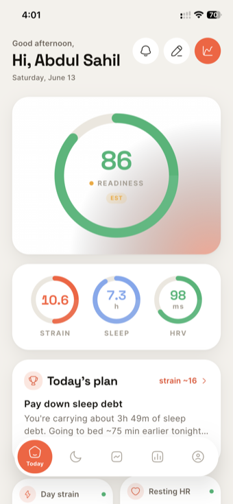<br>**Today** — readiness up top, then the Strain / Sleep / HRV gauges and your plan for the day. | 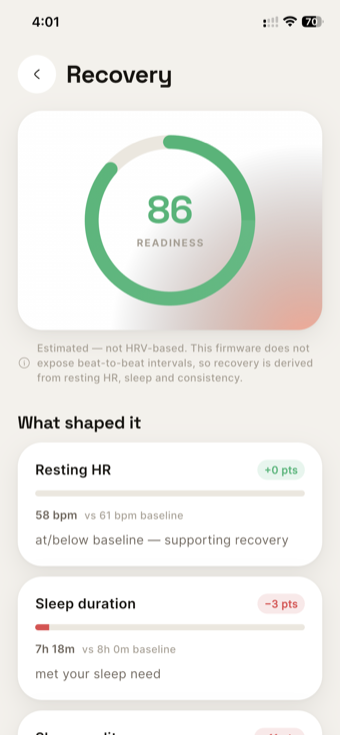<br>**Recovery** — the readiness number broken down into what actually shaped it (resting HR, sleep, consistency). | 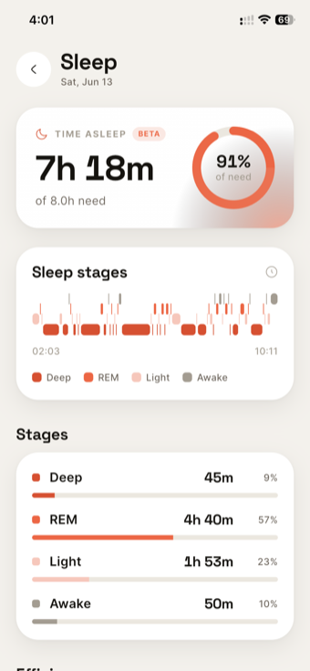<br>**Sleep** — time asleep vs. need, a stage estimate, efficiency, debt, and nocturnal heart. |
| 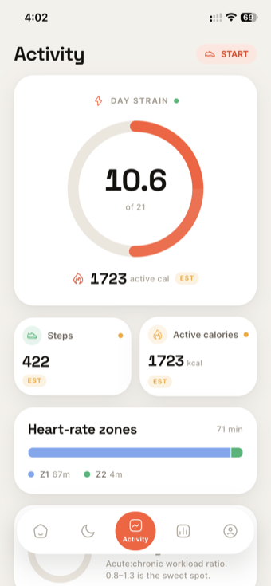<br>**Activity** — day strain, time in HR zones, training load, and auto-detected workouts. | 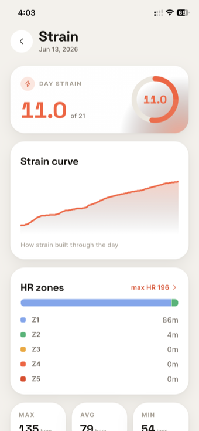<br>**Strain detail** — how strain built through the day, zone breakdown, and HR highs/lows. | 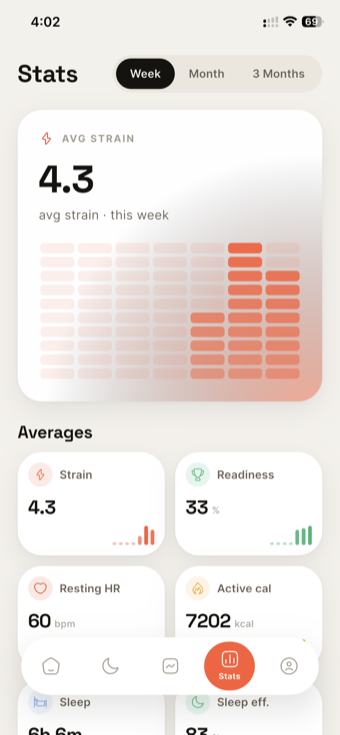<br>**Stats** — week / month / 3-month trends for strain, recovery, resting HR, sleep, and wear. |
| 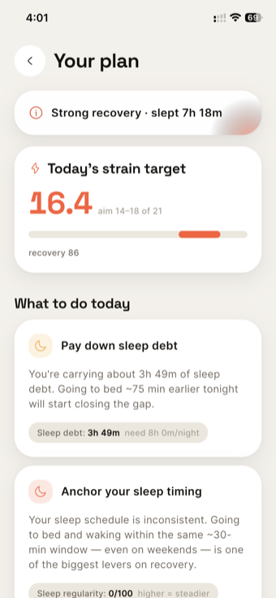<br>**Coach** — a deterministic plan: a strain target and a few ranked, plain-English suggestions. | 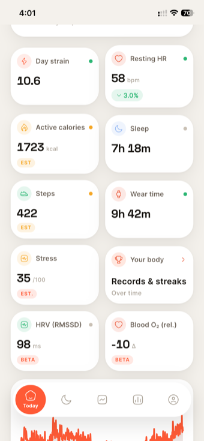<br>**Metrics** — the full tile set: resting HR, calories, steps, wear time, stress, HRV (RMSSD), blood-O₂. | 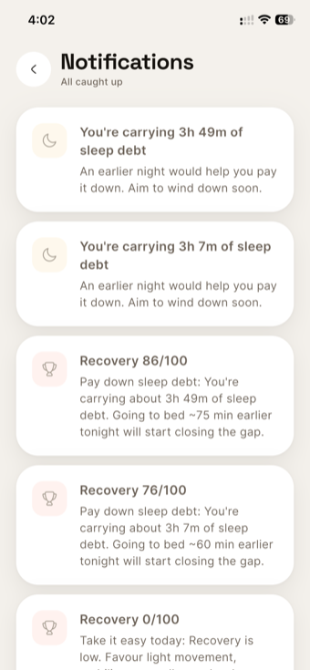<br>**Notifications** — server-generated nudges (sleep debt, recovery, milestones), capped so it stays signal. |
| 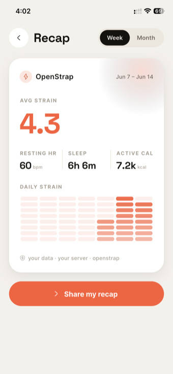<br>**Recap** — a shareable weekly card of your numbers. | 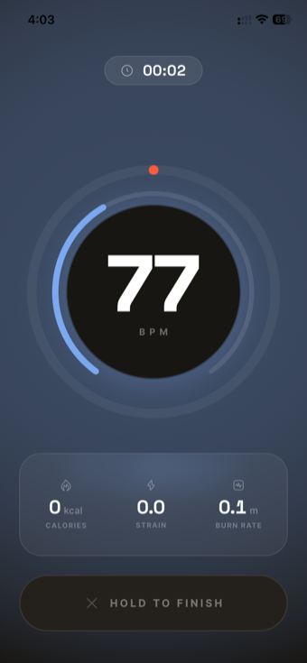<br>**Live workout** — real-time HR, live strain, calories, and burn rate while you train. | 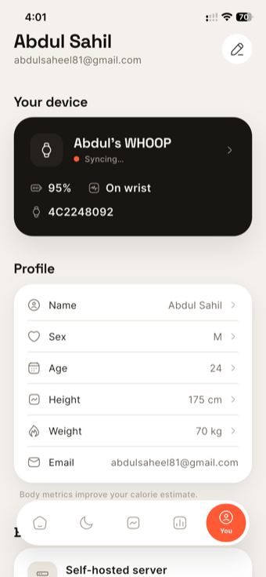<br>**Profile** — device + wear status, your body metrics, and the self-hosted-backend toggle. |

iOS extras:

| | |
|:--:|:--:|
| 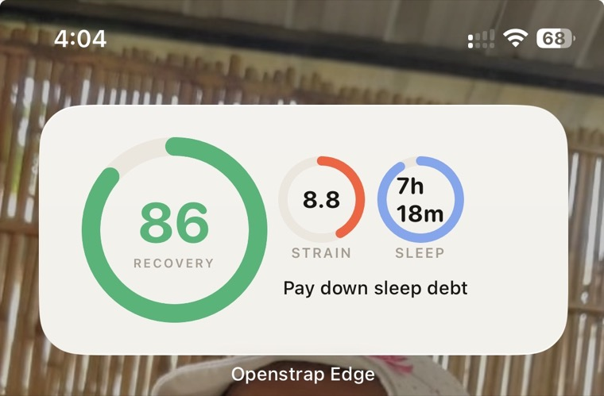<br>**Home-screen widget** — recovery, strain, and sleep at a glance, self-refreshing. | 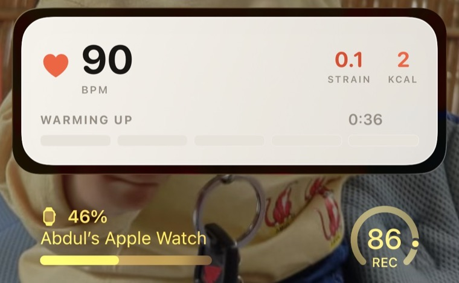<br>**Live Activity** — workout stats on the lock screen and Dynamic Island. |

> Numbers shown are real output from a WHOOP 4.0. HRV and Blood-O₂ are newer and marked
> beta in-app; everything carries a confidence and estimates are labelled.

## How it's put together

The flow, top to bottom:

```
        the screens  (lib/ui)  ──read──►  AppState  (lib/state)
                                              the one source of truth
        ┌──────────────────────────────────────┼──────────────────────────────────┐
        ▼                                        ▼                                  ▼
   BleEngine (lib/ble)              LocalDb (lib/data)                ApiClient (lib/net)
   talks to the band                SQLite, raw bytes first          talks to your backend
        │                                ▲                                    │
        └─ frames ─► framing.dart ─► records.dart ─► insertRecord            POST /ingest
                     reassemble        decode        (raw + decoded)         GET /today, etc.
                                                          │
                                                     Uploader (lib/sync) ─► backend, then
                                                     delete the uploaded rows locally
```

`AppState` is a `ChangeNotifier` and it's the only thing the UI ever reads. It owns the
BLE engine, the database, the uploader, and your session. Screens don't talk to Bluetooth
or HTTP directly, they read `AppState` and it orchestrates everything underneath.

## The Bluetooth part, which is the hard part

`BleEngine` in `lib/ble/ble_engine.dart` is where the real work is. The band speaks a
custom GATT service (`61080001-...`): one characteristic you write commands to, a few you
subscribe to for responses, events, and data.

A sync goes like this. Connect, bond (Android needs an explicit bond), bump the MTU to
247, subscribe to the notify characteristics. Then set the clock, because the band ships
with its real-time clock unset and if you skip this every record gets a garbage timestamp.
Then fire the five-packet intro that ends with "send me your history," and the band starts
draining records from its flash.

Here's the bit that trips everyone up. The band sends records in batches, and after each
batch it sends a marker carrying an 8-byte token. You have to read that token out of
`inner[13:21]` and send it straight back, with a write-that-waits-for-acknowledgement, not
a fire-and-forget write. Echo it exactly and the read cursor moves forward. Echo it wrong,
or use the wrong write type, and the band re-sends the same batch over and over. It stops
on its own when it's drained everything, or when it goes quiet for 8 seconds, or when a
record shows up timestamped within 15 seconds of now (that means you're wearing it and
it's streaming live, so there's no point draining further).

Two more things the engine is careful about. Live commands and sync acknowledgements use
separate sequence-number ranges so they never collide. And the genuinely dangerous
commands, the ones that erase flash or force the optical LEDs on permanently, are behind a
guard and never sent; optical is wrist-gated only. You don't want to brick a band.

## Why the database looks the way it does

`lib/data/db.dart`. The important table is `raw_records`, and its primary key is the frame
hex itself. Every frame that comes off the band gets written there before anything else
happens to it. That's the safety net: if the network's down, if the app dies mid-sync, if
anything goes wrong, the bytes are already on disk and nothing is lost. `INSERT OR IGNORE`
on the hex means the same frame arriving twice is a no-op, so retries are safe.

There's a `samples` table too, the decoded 1 Hz telemetry, but that's just for showing you
live numbers. The raw frames are the truth, and the backend re-decodes them on its end.

Uploading is deliberately one-directional: the `Uploader` batches up unuploaded frames,
POSTs them, and once the server says 200 it *deletes* those rows locally. The server
having the data is the confirmation; keeping a local copy after that just bloats your
phone.

## Syncing in the background

You shouldn't have to open the app for it to work. `lib/sync/background_sync.dart`
registers an OS-scheduled task, WorkManager on Android, BGTask on iOS, that wakes roughly
every 15 minutes, connects if the band's in range, drains, uploads, and disconnects. No
permanent notification sitting in your status bar, no foreground service draining your
battery. If the band's out of range that cycle, fine, nothing happens and the next wake-up
catches up. It's allowed to miss; it's built to not care. 

## Getting around the code

| Where | What's there |
|-------|--------------|
| `lib/ble/` | the BLE engine: scan, connect, sync, live streams |
| `lib/protocol/` | framing and reassembly, the decoders, the command builders, the constants |
| `lib/data/` | the local SQLite store and its models |
| `lib/sync/` | the uploader, your saved config and session, the background task |
| `lib/net/` | the HTTP client, including token refresh |
| `lib/state/` | `AppState`, the one source of truth |
| `lib/ui/` | every screen: today, sleep, activity, the live workout, recovery, stress, trends, journal, coach, records, notifications, the shareable recap, profile, onboarding |
| `lib/widget/`, `lib/live/` | the home-screen widget and the iOS Live Activity bridges |
| `ios/OpenStrapWidget/` | the actual widget and Dynamic Island Live Activity (needs the `group.wtf.openstrap` App Group) |

## Running it

The backend address isn't baked in. You set it at build time, and if it's blank the app
asks you for one during onboarding.

```bash
cp .env.example .env          # put BACKEND_URL=https://your-backend... in it
flutter pub get
flutter run --dart-define-from-file=.env
```

Quit the official WHOOP app before you connect, Bluetooth only lets one app own the band
at a time. 

The CI workflow builds a release APK and pulls the backend URL from a repo
secret.

On iOS, the widget and Live Activity need the App Group set up, `NSSupportsLiveActivities`
turned on, and the background task id registered.

## Your backend, or mine

You can point this at your own server. That's the whole reason `BACKEND_URL` is a setting
and not a constant, stand up the [backend](https://github.com/OpenStrap/backend) yourself
and your data lives entirely on machines you control.

Or just use mine, it's less hassle. If you do, here's my promise: I will never do anything
with your health data except make the decoders and the analytics better over time. I'm not
selling it and I'm not interested in it. But you don't have to trust me on that, that's
what the self-host option is for.

## The stack, briefly

`flutter_blue_plus` for Bluetooth, `sqflite` for the local store, `http` and `provider`
and `shared_preferences` for the plumbing, `workmanager` for the background sync,
`home_widget` for the widget bridge, and `fl_chart` / `google_fonts` / `hugeicons` /
`share_plus` for the look of it.


# Please raise Fixes, Lets make it better together